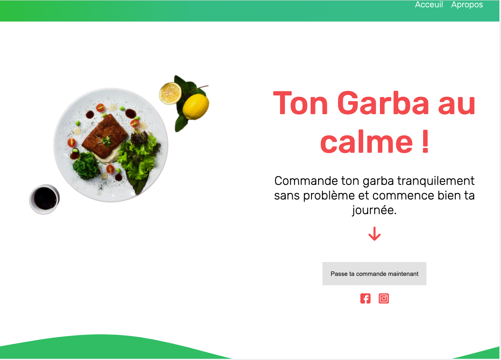
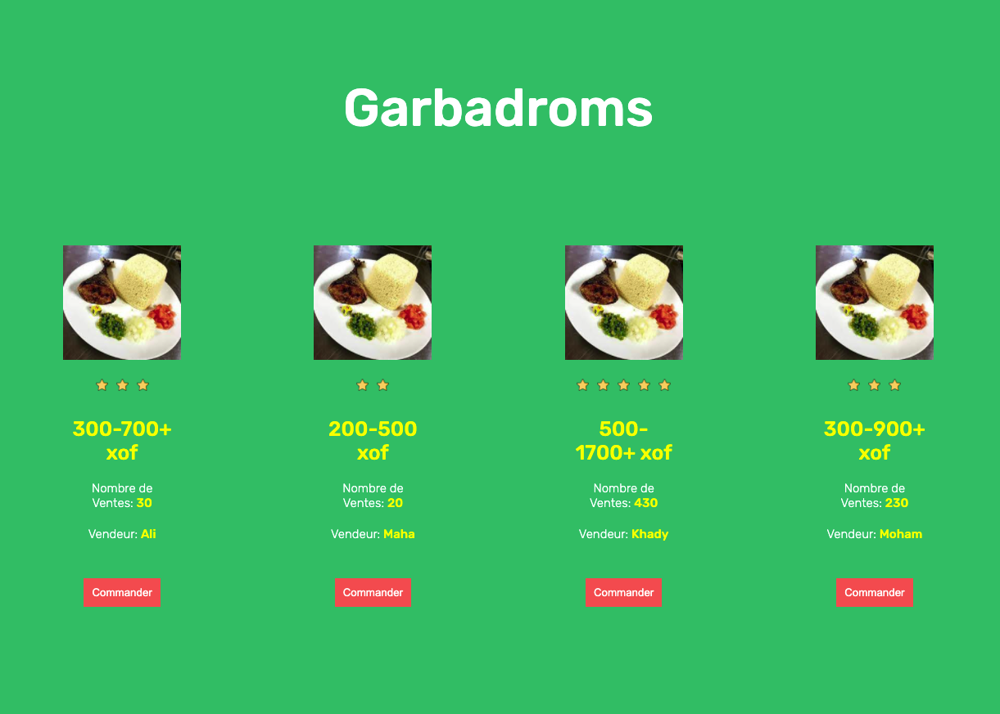
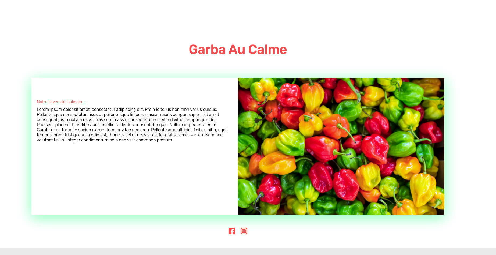

# Ton Garba Au Calme Plateforme.

Un tutoriel simple pour débutant qui montre dans la pratique comment appliquer directement HTML5/CSS3/Javascript et mettre en place une plateforme de restauration où les utilisateurs peuvent commander des plats communement appelés GARBA. 
Enjoy !!

---

## Live DEMO 
click here for live demo ==> https://africacoders.github.io/garba_webpage/

## Screenshots




## Pré-requis
- Aucun prérequis n'est necessaire, vu que vous avez les details dans le tutoriel.

## Install & Dependence
- On passera tout en revue.


## Utiliser ce repertoire
- D'abord vous devez "fork le projet"
  ```
    git clone https://github.com/AfricaCoders/garba_webpage.git
  ```
- Ensuite rendez-vous dans le dossier copié et ensuite vous pouvez le modifier


## License
MIT

## Auteur

```
Code with Africa @ Anvi Alex
```
